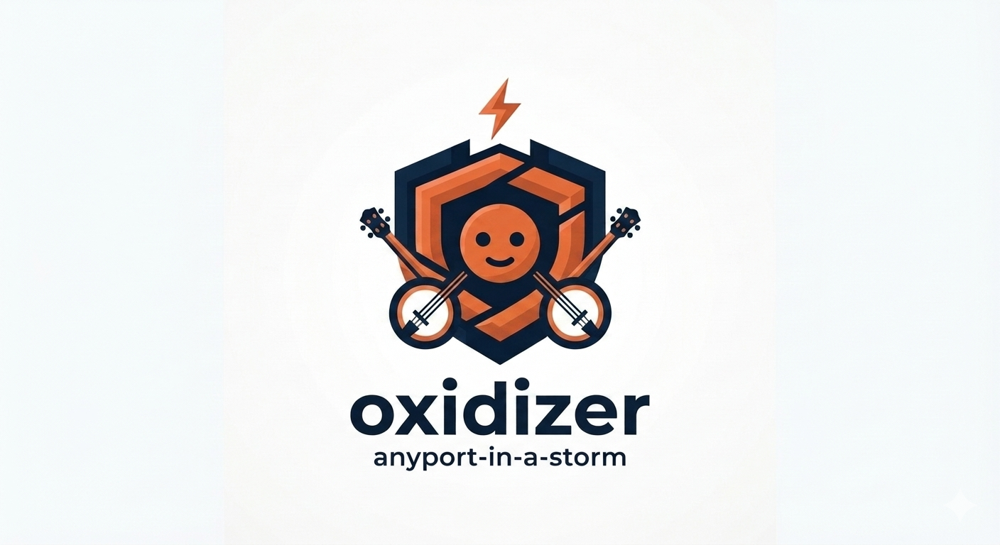

# ⚡ anyport-in-a-storm (oxidizer)
v0.0.3
**Machine-speed reflex-action tooling for actors defending machine-speed threat models.**

> [!CAUTION]
> **Pre-production.** Await v1.0.0 before using this in production or regulated deployments.
> *Oxidizing pqc-amplification DDoS packets, one subnet at a time.*

<p align="center">
  
</p>

Welcome to the public repo for **anyport-in-a-storm** (internally, **`oxidizer`**) — first in a suite of PQC-aware, machine-speed tools for threat-model actors. It runs at **Tier-2 timing** (post-SKB, the same early window as Generic XDP) with **Tier-2 *and* Tier-3 availability** — no driver, hypervisor, or NIC cooperation required.

It's not an app, process or systemd: it simply an ultra-lightweight `nftables` firewall provisioner written in modern Rust (Edition 2024). It works for us — we provide its binary to our autonomous-ai who acts as sentinal to all our metal, actually in production throughout the `rustykey.io` and `rustykey.me` infrastructure suite. Is it good enough for others to use, or production-ready? Not likely, and certainly not without sandboxing and testing first. Publishing the exact tool our own autonomous-ai wields is possibly miscalculated — we're betting the ranch, *our* ranch, on Kerckhoffs's Principle holding.

## Motivation
"Who's pickin' the banjo here?"

— Boorman, J. (Director). (1972). [*Deliverance*](https://youtu.be/NFutge4xn3w?si=RjAqaMt1FwRQMTYq). Warner Bros.

Will humans still be triggering packet drops at wire speed in 2027?

Alright, alright — there's some hyperbole here. The real threats from autonomous-ai, agentic-ai, and human footguns are probably milder than we're painting them, still safely out to sea rather than crashing on the shore.

Just in case...

## Who's this for?
In a galaxy far, far away, they were once called `SysAdmins` — all-knowing, endlessly competent, holding the frontline while the machines they controlled served them faithfully in return. Richly rewarded, deeply respected, and happily self-isolated in the corporate nerdery, these heroes of the metal kept companies and people safe from the threat actors of their day.

But in our corner of the galaxy, humankind needs something a little different. Today's fastest-rising threat — and opportunity — isn't human at all: it's machine-speed actors, autonomous-ai and agentic-ai.

As of September 2026, of roughly 30 million active GitHub repos, ~300,000 carried an `@context` schema, and ~60,000 shipped an `AGENTS.md` — both built to treat autonomous and agentic users as first-class counterparties, not afterthoughts.

The heroes evolved too. `SysAdmins` gave way to `DevOps` and `SecOps` — twin disciplines that kept the lights on and the gates shut while the internet grew up. They're still essential.

But neither was built for this particular fight. `DevOps` optimizes for shipping fast to consumers who click a mouse or speak a known API contract. `SecOps` optimizes for defending a perimeter against threats that move at human speed — minutes to notice, hours to respond, days to post-mortem. Both assume the thing on the other end of the connection has a face, or at least a predictable shape.

Machine-speed actors don't play by that clock. An autonomous or agentic counterparty can be entirely legitimate on request one and quietly hijacked by request two, all inside the time it takes a human to blink. It doesn't have a face to check at the door, and cannot be bound to a device through WebAuthn to prove through biometrics its authenticity. Standards and working code are quickly converging to solve this, but it's a gap.

That's the gap nobody's job description covers yet. Not `DevOps`. Not `SecOps`. Something that sits between or rather around them — continuous, cryptographic, machine-speed verification of who, or what, is actually on the other end of the wire, on every request, not just at login.

Call it `TrustOps`, if you need a name for an org chart.

This is who we built `oxidizer` for.

## Big Deal, or 🌪️ in a Teacup?
You've read this far: are you already convinced this **IS** a big deal, or **IS NOT**? We respect your choice and your time; this repo probably won't interest you.

This one's for the undecided: you're thinking "perhaps it **may** be a big deal — tell me more... but know that I don't trust you either."

### Doesn't eBPF/XDP already solve this?
Yes — hyperscalers use eBPF/XDP extensively, internally. But for ~100% of today's agentic-ai and autonomous-ai actors, and ~97% of everyday developers on standard VPS instances (no root-level hypervisor access, no XDP-capable NIC), that speed simply isn't available. See the table below.

Today's operational-safety practices — change review, canary windows, on-call escalation, rollback — are excellent, mature, and built on one assumption: a human has enough reaction time to intervene before damage compounds.

Machine-speed autonomous `sudo` on firewall rules changes that assumption. They're not just "faster ops" — it's a different risk category. When things go wrong, the blast radius completes and dust is settling before any human, however attentive, can act.

### Global Cloud Instances by eBPF/XDP Reflex-Layer Accessibility
*(This table describes eBPF/XDP hook accessibility specifically — not `oxidizer`, which operates via the netfilter-based ingress hook, unavailable to eBPF/XDP. Related, but architecturally separate. Tiers count down from most common/least capable (Tier 3) to rarest/most capable (Tier 0).)*

| Tier | Mechanism | Est. Market Share | Est. Instance Count | Typical Hosts | Reality Check |
|---|---|---|---|---|---|
| **Tier 3 — Hypervisor Block** | No eBPF/XDP hooks (traditional `sk_buff` networking only) | ~75% | ~22,500,000 | Hyperscalers (AWS EC2/Lightsail, GCP, Azure), traditional shared VPS (Linode, Akamai, standard instances) | **No reflex.** Packets traverse the host's virtual switch (Open vSwitch, AWS Nitro) before reaching your VM. Your OS handles them via the standard slow-path kernel buffer. No inline XDP drops possible. |
| **Tier 2 — Emulated Sandbox** | `XDP_SKB` / Generic Mode (software emulation above the OS stack) | ~24.5% | ~7,350,000 | Modern developer clouds (Hetzner Cloud, DigitalOcean, Vultr, Scaleway, OVHcloud VPS) | **Borrowed reflex.** XDP programs load, but the hypervisor forces Generic Mode — the OS has already allocated metadata, burned CPU cycles, and fired interrupts before your program sees the packet. You skip user-space but miss line-rate flood speeds. |
| **Tier 1 — True Native Reflex** | `XDP_DRV` / Native Mode (runs inside the hardware driver) | ~0.49% | ~147,000 | Dedicated bare metal (Hetzner Dedicated, OVH Dedicated, Vultr Bare Metal, colocation) | **True reflex.** Code runs the moment a packet leaves the ring buffer — evaluated and dropped in nanoseconds. Requires a physical NIC driver with native XDP support. |
| **Tier 0 — The Absolute Edge** | `XDP_ZEROCOPY` (direct hardware DMA to memory space) | < 0.01% | ~3,000 | Custom bare metal with enterprise NICs (Intel i225/i226/ICE, Mellanox ConnectX-5+) | **Zero-copy reflex.** The NIC uses DMA to hand packets straight to your AI's memory block (UMEM) — zero CPU copies. Only available to teams running custom metal with specific enterprise NIC configurations. |

*(Numbers are estimates and will be refined as better data comes in — inherently dynamic.)*

### Where does `oxidizer` fit?
> [!IMPORTANT]
> `oxidizer` binds to nftables' netdev **ingress hook** (`NF_NETDEV_INGRESS`) — a netfilter feature, not eBPF/XDP.
> **Timing:** the same early post-SKB window as Generic XDP (Tier 2).
> **Availability:** needs no driver, hypervisor, or hardware cooperation — works identically at every tier above, **including Tier 3**, where XDP doesn't exist at any level.

Packet-path ordering, so you can see exactly where `oxidizer` lives:
1. NIC hardware DMA → ring buffer
2. **[Tier 0]** `XDP_ZEROCOPY` / AF_XDP — pre-SKB, direct to userspace UMEM
3. **[Tier 1]** `XDP_DRV` native XDP — pre-SKB, inside the driver
4. *— SKB allocated —*
5. **[Tier 2]** `XDP_SKB` generic XDP — post-SKB, software fallback
6. **← `oxidizer` lives here.** nftables netdev ingress hook — same early window as step 5, via the netfilter rule engine instead of eBPF
7. Classic `PREROUTING` chain + conntrack — **where almost everyone, at every tier, is actually filtering today**
8. Routing / FIB lookup
9. Local delivery / socket

| Hook | Subsystem | Pre/Post-SKB | Needs driver/hypervisor XDP support? | Works on Tier 3 (~75% of the market)? |
|---|---|---|---|---|
| AF_XDP zerocopy | eBPF/XDP | Pre-SKB | Yes (Tier 0 hardware) | ❌ No |
| Native XDP | eBPF/XDP | Pre-SKB | Yes (Tier 1 driver) | ❌ No |
| Generic XDP | eBPF/XDP | Post-SKB | Often blocked by hypervisor BPF restrictions | ⚠️ Inconsistent |
| **nftables ingress (`oxidizer`)** | Netfilter | Post-SKB | **No — plain kernel feature, not BPF-gated** | ✅ **Yes, always** |
| `PREROUTING` + conntrack | Netfilter | Post-SKB, pre-routing | No | ✅ Yes (the baseline everyone actually runs) |

### Summary
`oxidizer` can't chase native-XDP nanoseconds. But it beats the *real* baseline most actors run today — conntrack-gated `PREROUTING` filtering — at zero added infrastructure cost, on nearly every host tier, **including the ~75% where XDP isn't an option at any level.**

---
## The Post-Quantum Cryptography (PQC) DDoS Vector

As the internet transitions to Post-Quantum Cryptography, servers must handle cryptographic primitives orders of magnitude larger than legacy Elliptic Curve or RSA:

| Cryptographic Scheme | Signature / Key Size |
|---|---|
| **SQIsign-L1** | ~129 bytes |
| **ML-DSA-44** | ~2,420 – 4,595 bytes |
| **FN-DSA-512** | ~666 – 1,280 bytes |
| **SLH-DSA-SHA2-128s** | Up to **7,856+ bytes** |
| **ECDSA (not quantum-resistant)** | ~64 bytes |


### The threat: PQC-amplified handshake floods

Because PQC public keys and signatures require transmitting thousands of bytes per TLS/SSH client-hello, a malicious actor can orchestrate a **PQC-amplified DDoS**. By firing hundreds of malformed or oversized PQC negotiation packets per second from a distributed botnet, bad actors can exhaust CPU state tables, saturate ingress buffers, and grind even powerful edge nodes to a halt — *even with perfectly optimized application code*. And as selective-disclosure stacks multiple signatures *inside* an already-signed document, that amplification compounds further.

### How `oxidizer` fights back

`oxidizer` filters at the nftables netdev-ingress hook (`NF_NETDEV_INGRESS`) — the earliest point the standard netfilter stack allows, binding directly to the interface (`ingress device "eth0"`). So it isn't eBPF/XDP, not Tier 0/1 — but does drop malicious IP blocks from high-risk or telemetry-heavy regions *before* the packet reaches conntrack table allocation, routing lookup, or a single memory-intensive PQC validation routine.

It helps automate and speed up a plain kernel feature, available on most Linux hosts — including the ~75% of the market where XDP isn't an option at any level. It's Rust, not shell, because it's meant to be wielded by machines: it isn't an API, a daemon, or a systemd service — it expects an automated defensive agent to monitor telemetry, compute the threat dynamically, and command the firewall to drop or allow traffic in response.

---

## Quick Start

```bash
cargo build --release
sudo ./target/release/fw test
```

📖 Docusaurus docs coming soon to GitHub Pages.

## repomix

```bash
pnpx repomix --style markdown
```

## Check, Lint, Test, Build, Deploy

```bash
# --- Check, lint, format, test ---
cargo check -p oxidizer-firewall                                # fast type-check, no codegen — run this constantly
cargo clippy -p oxidizer-firewall --all-targets -- -D warnings  # lint — run before every commit
cargo fmt                                                        # format the whole workspace
cargo test -p oxidizer-firewall                                 # unit tests (network.rs, countdown.rs, etc.)

# --- Build ---
cargo build -p oxidizer-firewall             # debug build   -> target/debug/fw
cargo build -p oxidizer-firewall --release   # release build -> target/release/fw

# --- Build + run in one step ---
cargo run -p oxidizer-firewall -- flushinoneminute
cargo run -p oxidizer-firewall --release -- flushinoneminute
cargo run -p oxidizer-firewall --release

# --- Direct binary execution (requires root) ---
sudo ./target/release/fw flushinoneminute --geoipblock=false
sudo ./target/release/fw flushinoneminute
sudo ./target/release/fw

# --- Confirmed-good ruleset -> persist it ---
sudo nft list ruleset > /etc/nftables.conf
```# anyport-in-a-storm-oxidizer
